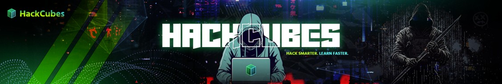

<font 
size='15'><b>Sound of Secrets</b></font>

17<sup>th</sup> November 2025  
Prepared By: Aryan  
Challenge Author(s): Aryan  
&nbsp;&nbsp;&nbsp;&nbsp;&nbsp;&nbsp;&nbsp;&nbsp;&nbsp;&nbsp;&nbsp;&nbsp;&nbsp;&nbsp;&nbsp;&nbsp;&nbsp;&nbsp;&nbsp;&nbsp;&nbsp;&nbsp;&nbsp;&nbsp;&nbsp;&nbsp;&nbsp;Difficulty: <font color=orange>Medium</font>  
&nbsp;&nbsp;&nbsp;&nbsp;&nbsp;&nbsp;&nbsp;&nbsp;&nbsp;&nbsp;&nbsp;&nbsp;&nbsp;&nbsp;&nbsp;&nbsp;&nbsp;&nbsp;&nbsp;&nbsp;&nbsp;&nbsp;&nbsp;&nbsp;&nbsp;&nbsp;&nbsp;Classification: Official  

## Synopsis

Sound of Secrets is a medium-difficulty forensics challenge that tests your ability to uncover hidden messages through audio analysis and layered encoding. An innocent-sounding WAV file conceals a Morse code message that requires further decryption to reveal the final flag.
Sound of Secrets

You are provided with `Hola.wav`, an audio file that appears ordinary at first. Hidden within the audio are carefully timed beeps and pauses that encode a message in Morse code. Once decoded, the Morse reveals an encoded string that requires additional cryptanalysis to extract the final secret.

Your mission: analyze the audio, decode the Morse pattern, decrypt the hidden cipher, and capture the flag.

***

## Skills Required

- Audio analysis and pattern recognition
- Morse code interpretation (dots and dashes)
- Knowledge of classical ciphers (ROT13)
- Experience with online decoding tools

## Skills Learned

- Converting audio signals to Morse code using online tools
- Identifying and decrypting ROT13-encoded text
- Understanding layered encoding techniques in CTF challenges
- Using multiple tools in sequence for multi-stage challenges

***

## Provided Files

```
Hola.wav - Audio file containing the hidden Morse code message
```

***

## Solution Walkthrough

### Step 1: Morse Code Extraction from Audio

Navigate to [Morse Code Translator](https://morsecode.world/international/decoder/audio-decoder-adaptive.html). This tool supports direct audio file upload and automatic Morse code detection.

Upload `Hola.wav` to the website. The tool analyzes the audio waveform, detects the beep patterns, and automatically decodes the Morse code sequence.

The decoded output reveals:


```
guvf vf gur frperg zrffntr rire
```

### Step 2: Cipher Recognition and Decryption

The decoded text `guvf vf gur frperg zrffntr rire` doesn't appear to be valid English, but the pattern suggests a substitution cipher. The text structure and word lengths hint at ROT13 encoding—a simple Caesar cipher with a 13-letter shift.

Using [CyberChef](https://gchq.github.io/CyberChef/), apply the ROT13 operation:

**Input:** `guvf vf gur frperg zrffntr rire`  
**Output:** `this is the secret message ever`

### Step 3: Flag Construction

With the plaintext message revealed, construct the flag according to the standard CTF format:

```
hackcubes{this_is_the_secret_message_ever}
```

***

## Summary

This challenge demonstrated a multi-stage decoding process:

1. Audio file uploaded to Morse code translator for automatic decoding
2. Morse translation produced ROT13-encoded text
3. ROT13 decryption via CyberChef revealed the secret message
4. Message conversion yielded the final flag

The challenge reinforced the importance of leveraging online tools and recognizing common encoding schemes in forensics investigations.

***

## Flag

```
hackcubes{this_is_the_secret_message_ever}
```

***

## Tools Used

- **[Morse Code Translator](https://morsecode.world/international/translator.html)** - Audio to Morse code conversion

- **[CyberChef](https://gchq.github.io/CyberChef/)** - ROT13 decryption


